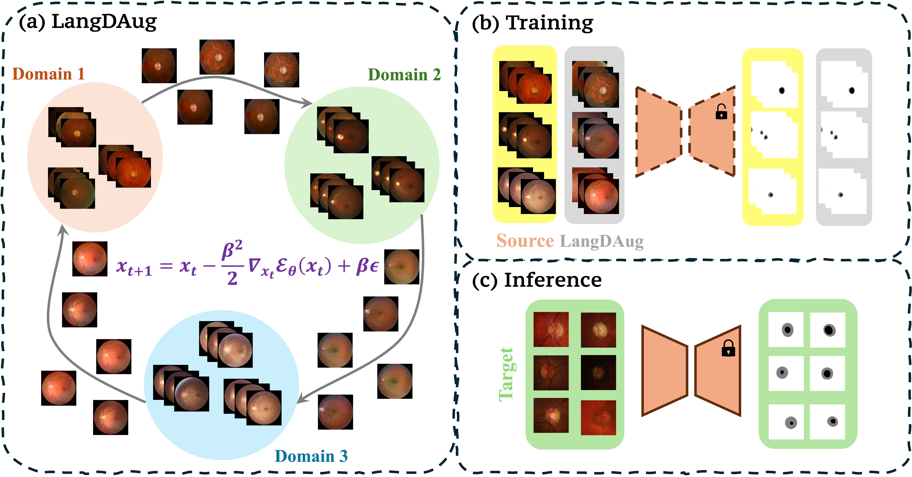

# 🔬 LangDAug: Langevin Data Augmentation for Multi-Source Domain Generalization in Medical Image Segmentation

[](https://openreview.net/forum?id=LB5F02kwAv)
[](https://pytorch.org/)
[](https://opensource.org/licenses/MIT)
[](https://arxiv.org/)

<p align="center">
  
</p>

## 🌟 Highlights

- **🏆 State-of-the-art Performance**: Achieves **87.61% mDSC** on Fundus and **89.16% DSC** on Prostate MRI segmentation
- **🔄 Novel Approach**: First to leverage Langevin dynamics for domain-bridging data augmentation
- **📈 Consistent Improvements**: Enhances existing domain randomization methods by up to **3.05% mIoU**
- **🧮 Theoretical Foundation**: Proven regularization effects with bounds on Rademacher complexity
- **🏥 Medical Focus**: Specifically designed for medical image segmentation challenges

## 📋 Table of Contents

- [Overview](#-overview)
- [Method](#-method)
- [Results](#-results)
- [Installation](#-installation)
- [Quick Start](#-quick-start)
- [Datasets](#-datasets)
- [Training](#-training)
- [Evaluation](#-evaluation)
- [Citation](#-citation)
- [Acknowledgments](#-acknowledgments)

## 🔍 Overview

LangDAug is a novel data augmentation technique for multi-source domain generalization in medical image segmentation. By leveraging Energy-Based Models (EBMs) trained via contrastive divergence, we generate intermediate domain samples through Langevin dynamics that act as bridges between source domains.

### Key Features

- **Domain Traversal**: Uses EBMs to traverse between source domain pairs
- **Langevin Sampling**: Generates intermediate samples via Langevin dynamics
- **Plug-and-Play**: Can enhance existing domain randomization methods
- **Theoretically Grounded**: Provides regularization with proven generalization bounds

## 🔧 Method

Our approach consists of three main steps:

1. **EBM Training**: Train Energy-Based Models to traverse between source domains using contrastive divergence
2. **Langevin Sampling**: Generate intermediate domain samples through Langevin dynamics
3. **Augmented Training**: Train segmentation models with both original and Langevin samples

## 📊 Results

### Retinal Fundus Segmentation

| Method | Domain A | Domain B | Domain C | Domain D | Avg mIoU | Avg mDSC |
|--------|----------|----------|----------|----------|----------|----------|
| Hutchinson | 66.73 | 66.73 | 69.36 | 66.73 | 67.39 | 78.14 |
| MixStyle | 80.76 | 67.69 | 79.79 | 77.09 | 76.33 | 85.58 |
| FedDG | 76.65 | 72.14 | 76.10 | 75.96 | 75.21 | 83.67 |
| RAM | 77.42 | 73.79 | 79.66 | 78.74 | 77.40 | 85.39 |
| TriD | 80.92 | 72.45 | 79.34 | 78.96 | 77.92 | 85.95 |
| **LangDAug (Ours)** | **78.79** | **75.05** | **81.01** | **80.51** | **78.84** | **87.61** |

### Prostate MRI Segmentation

| Method | Domain A | Domain B | Domain C | Domain D | Domain E | Domain F | Avg ASD | Avg DSC |
|--------|----------|----------|----------|----------|----------|----------|---------|---------|
| Hutchinson | 3.28 | 1.48 | 2.07 | 3.98 | 2.78 | 1.64 | 2.54 | 78.62 |
| MixStyle | 0.72 | 0.88 | 1.62 | 0.65 | 1.59 | 0.51 | 1.00 | 86.27 |
| FedDG | 1.09 | 0.93 | 1.31 | 0.88 | 1.73 | 0.50 | 1.07 | 85.95 |
| RAM | 0.93 | 0.98 | 1.26 | 0.74 | 1.78 | 0.32 | 1.00 | 87.02 |
| TriD | 0.70 | 0.72 | 1.39 | 0.71 | 1.43 | 0.46 | 0.90 | 87.68 |
| **LangDAug (Ours)** | **0.58** | **0.64** | **1.21** | **0.57** | **1.49** | **0.38** | **0.81** | **89.16** |

## 🚀 Installation

### Prerequisites

- Python 3.8+
- CUDA 11.0+
- PyTorch 1.9+

### Setup

1. Clone the repository:

```bash
git clone https://github.com/backpropagator/LangDAug.git
cd LangDAug
```

2. Create and activate conda environment:

```bash
conda env create -f pt-gpu.yml
conda activate pt-gpu
```

## 🎯 Quick Start

### 1. Train VQ-VAE

```bash
bash run_vqvae.sh
```

### 2. Train EBMs for Domain Translation

```bash
bash run_ebm_LAB_LD.sh
```

### 3. Generate Augmented Samples

```bash
bash run_convert_LAB_LD.sh
```

### 4. Train Segmentation Model

```bash
cd ../pytorch-deeplab-xception/
bash train_fundus.sh
```

## 📂 Datasets

### Download Links

- **Fundus Dataset**: [Download](https://drive.google.com/file/d/1p33nsWQaiZMAgsruDoJLyatoq5XAH-TH/view)
- **Prostate Dataset**: [Download](https://liuquande.github.io/SAML/)

### Directory Structure
```plaintext
VQ-VAE/
├── datasets/
│   ├── fundus/
│   │   ├── train/
│   │   │   ├── Domain1/
│   │   │   │   ├── image/
│   │   │   │   └── mask/
│   │   │   └── Domain2/
│   │   └── test/
│   └── prostate/
│       ├── BMC/
│       ├── BIDMC/
│       └── ...
```

## 🏋️ Training

### Training with LangDAug

For fundus segmentation:
```bash
python train.py --backbone resnet34 --dataset fundus --splitid 1 2 3 --testid 4 --with_LAB_LD
```
For prostate segmentation:
```bash
python train.py --backbone resnet34 --dataset prostate --splitid BMC RUNMC UCL --testid BIDMC --with_LAB_LD
```
### Training with Domain Randomization + LangDAug

python train.py --backbone resnet34 --dataset fundus --method TriD --with_LAB_LD

## 📈 Evaluation

To evaluate a trained model:
```bash
python train.py --backbone resnet34 --dataset fundus --testid 4 --resume /path/to/checkpoint.pth.tar --testing
```
## 🔬 Ablation Studies

<details>
<summary>Click to expand ablation study results</summary>

### Effect of Langevin Steps (K)

| K | 20 | 40 | 60 | 80 |
|---|----|----|----|----|
| mIoU | 76.2 | 78.8 | 78.5 | 78.3 |

### Effect of Step Size (β)

| β | 0.1 | 0.5 | 1.0 | 2.0 |
|---|-----|-----|-----|-----|
| mIoU | 77.1 | 78.2 | 78.8 | 76.9 |

</details>

## 📖 Citation

If you find this work useful, please cite:
```bibtex
@inproceedings{tiwary2025langdaug,
  title={LangDAug: Langevin Data Augmentation for Multi-Source Domain Generalization in Medical Image Segmentation},
  author={Tiwary, Piyush and Bhattacharyya, Kinjawl and Prathosh, A.P.},
  booktitle={Proceedings of the 42nd International Conference on Machine Learning},
  year={2025}
}
```

## 🙏 Acknowledgments

This work was supported by:
- Indian Institute of Science startup grant
- Prime Minister's Research Fellowship
- Kotak IISc AI-ML Center (KIAC)
- Infosys Foundation Young Investigator Award

We thank the authors of [pytorch-deeplab-xception](https://github.com/jfzhang95/pytorch-deeplab-xception) and [latent-energy-transport](https://github.com/YangNaruto/latent-energy-transport) for their open-source implementations.

## 📄 License

This project is licensed under the MIT License - see the [LICENSE](LICENSE) file for details.

---

<p align="center">
  <a href="https://github.com/backpropagator/LangDAug">
    
  </a>
  <a href="https://github.com/backpropagator/LangDAug/issues">
    
  </a>
  <a href="https://github.com/backpropagator/LangDAug/network">
    
  </a>
</p>

<p align="center">
  Made with ❤️
</p>